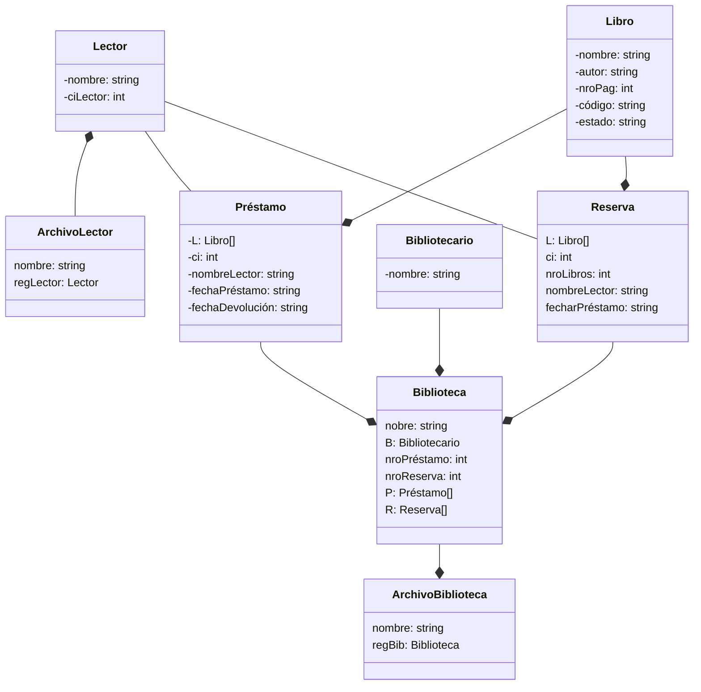

## Persistencia de datos en java
La persistencia de datos en Java se refiere a la capacidad
de almacenar y recuperar información de forma permanente en una
aplicación. Permite que los datos se mantengan más allá de la 
ejecución del programa, lo que implica que se guarden en algún 
tipo de almacenamiento persistente, como una base de datos, 
archivos en disco o incluso servicios en la nube.

